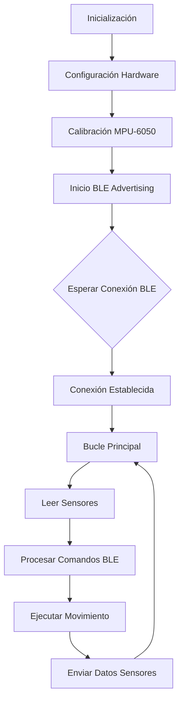
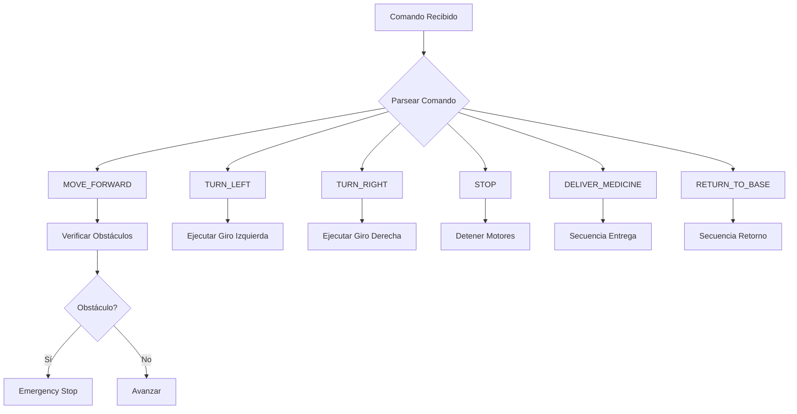

# Documentación de Diseño

---

# Diseño de Hardware

## 1. Selección y Justificación del Microcontrolador

### 1.1. Microcontrolador ESP32-WROOM-32

* **Procesador:** Xtensa® dual-core 32-bit LX6 a 240 MHz
* **Memoria:** 520 KB SRAM, 4 MB Flash
* **Conectividad:** WiFi 802.11 b/g/n, Bluetooth 4.2 BR/EDR y BLE
* **Periféricos:** 34 GPIO, 18 canales ADC, 2 DAC, 10 sensores touch
* **Interfaces:** UART, I2C, SPI, I2S, PWM

### 1.2. Justificación de Selección

* **Integración WiFi/BLE:** Elimina necesidad de módulos externos
* **Potencia de Cómputo:** Suficiente para algoritmos de control y filtrado
* **Costo-Beneficio:** ~$5-8 USD, excelente relación precio/rendimiento
* **Ecosistema:** Amplia documentación y comunidad de soporte
* **Consumo Energético:** Eficiente para aplicaciones móviles con batería

---

## 2. Diagramas de Conexión

### 2.1. Esquema de Conexiones Principales

```
ESP32-WROOM-32
├── Sistema de Movimiento
│   ├── GPIO 27 (ENA) → L298N ENA
│   ├── GPIO 25 (IN1) → L298N IN1
│   ├── GPIO 26 (IN2) → L298N IN2
│   ├── GPIO 14 (ENB) → L298N ENB
│   ├── GPIO 18 (IN3) → L298N IN3
│   └── GPIO 19 (IN4) → L298N IN4
├── Sensores Ultrasónicos
│   ├── GPIO 4 (TRIG) → HC-SR04 TRIG
│   └── GPIO 5 (ECHO) → HC-SR04 ECHO
├── Sensores IR Línea
│   ├── GPIO 33 → TCRT5000 LEFT
│   ├── GPIO 32 → TCRT5000 CENTER
│   └── GPIO 35 → TCRT5000 RIGHT
├── MPU-6050
│   ├── GPIO 21 (SDA) → MPU-6050 SDA
│   └── GPIO 22 (SCL) → MPU-6050 SCL
└── Periféricos
    ├── GPIO 2 → LED Indicador
    └── GPIO 15 → Buzzer
```

---

## 3. Especificaciones de Sensores y Actuadores

### 3.1. Sensores Implementados

**HC-SR04 - Sensor Ultrasónico**

* Rango: 2 cm - 400 cm
* Precisión: ±3 mm
* Voltaje: 5 V DC
* Consumo: 15 mA
* Uso: Detección de obstáculos

**TCRT5000 - Sensor IR Línea**

* Tipo: Reflectivo infrarrojo
* Rango: 1 mm - 8 mm
* Salida: Digital/Analógica
* Uso: Seguimiento de línea negra

**MPU-6050 - Sensor de Movimiento**

* Acelerómetro: ±2g, ±4g, ±8g, ±16g
* Giroscopio: ±250, ±500, ±1000, ±2000 °/s
* Interface: I2C
* Uso: Orientación y estabilización

** 10T85 - Micro Interruptor de Límite**

* Uso: Limitación de alcance de tijeras en elevador


### 3.2. Actuadores

**Motores DC con Encoders**

* Voltaje: 6 V DC
* Velocidad: 100 RPM
* Par: 1.2 kg-cm
* Encoder: 11 CPR
* Uso: Propulsión principal

**Driver L298N**

* Voltaje motor: 5 V - 35 V
* Corriente pico: 2 A por canal
* Control: PWM y direccional
* Protección: Diodos flyback

---

## 4. Diseño del PCB / Tarjeta Perforada

### 4.1. Características del Diseño

* Tipo: PCB de 2 capas
* Material: FR-4, 1.6 mm
* Dimensiones: 80 mm x 60 mm
* Conectores: Headers para todos los sensores
* Regulación: LM7805 para 5 V, AMS1117 para 3.3 V

### 4.2. Consideraciones de Layout

* **Ruteo de Potencia:** Trazos anchos para motores (40 mil)
* **Aislamiento:** Separación entre señales digitales y analógicas
* **Conectores:** Estándar de 2.54 mm para fácil prototipado
* **Test Points:** Puntos de prueba para depuración

---

## 5. Análisis de Consumo Energético

### 5.1. Estimación de Consumo

|            Componente | Consumo Promedio | Consumo Máximo |
| --------------------: | ---------------: | -------------: |
|        ESP32 (activo) |            80 mA |         240 mA |
|       Motores DC (x2) |           200 mA |         800 mA |
| Sensores Ultrasónicos |            30 mA |          60 mA |
|           Sensores IR |            50 mA |          75 mA |
|              MPU-6050 |           3.9 mA |         3.9 mA |
|         LEDs y Buzzer |            20 mA |          50 mA |
|             **TOTAL** |     **383.9 mA** |  **1228.9 mA** |

### 5.2. Sistema de Alimentación

* Batería: Li-Ion 7.4 V 2000 mAh
* Autonomía: ~2–5 horas dependiendo del uso
* Regulación: Conversor buck para 5 V y 3.3 V
* Protección: Circuito de carga y protección BMS

---

## 6. Consideraciones de Diseño Mecánico

### 6.1. Chasis y Estructura

* Material: Acrílico de 3 mm cortado láser
* Dimensiones: 150 mm x 120 mm x 80 mm
* Montaje: Diseño modular para fácil mantenimiento
* Ruedas: Diámetro 65 mm con banda de goma

### 6.2. Distribución de Componentes

* **Centro de Gravedad:** Bajo y centrado
* **Acceso:** Fácil acceso a batería y PCB
* **Ventilación:** Espacios para disipación de calor
* **Cableado:** Canales para organización de cables

---

# Arquitectura de Software Embebido

## 1. Descripción de la Arquitectura del Software

### 1.1. Arquitectura por Capas

```
Capa de Aplicación
    ├── Gestor de Modos de Operación
    ├── Control de Misión (Medicina)
    └── Gestión de Configuración
        ↓
Capa de Servicios
    ├── Comunicación BLE
    ├── Gestión de Sensores
    └── Control de Movimiento
        ↓
Capa de Control
    ├── PID para Motores
    ├── Algoritmo de Navegación
    └── Filtrado de Sensores
        ↓
Capa de Abstacción de Hardware (HAL)
    ├── Drivers GPIO/PWM
    ├── Comunicación I2C/UART
    └── Control Directo de Periféricos
```

---

## 2. Diagramas de Flujo del Programa Principal

### 2.1. Flujo Principal de Ejecución



### 2.2. Manejo de Comandos BLE



---

## 3. Estrategias de Gestión de E/S

### 3.1. Manejo de Interrupciones

**Interrupciones Configuradas:**

* GPIO: Encoders de motores (medición velocidad)
* Timer: Muestreo periódico de sensores
* BLE: Eventos de conexión/desconexión

**Prioridades de Interrupción (ejemplo):**

```c
// Prioridades (0-15, 0 = máxima)
#define PRIORITY_EMERGENCY_STOP   0
#define PRIORITY_MOTOR_CONTROL    2
#define PRIORITY_SENSOR_READ      4
#define PRIORITY_BLE_EVENTS       6
#define PRIORITY_SYSTEM_TASKS     8
```

### 3.2. Estrategia de Sincronización

**Semáforos y Mutex:**

```c
// Recursos compartidos protegidos
SemaphoreHandle_t xSensorDataMutex;
SemaphoreHandle_t xMotorControlMutex;
SemaphoreHandle_t xBLESendMutex;

// Colas de comunicación
QueueHandle_t xCommandQueue;
QueueHandle_t xSensorQueue;
```

---

## 4. Protocolos de Comunicación Implementados

### 4.1. Bluetooth Low Energy (BLE)

**Servicio Personalizado:**

```c
// UUIDs del servicio
#define SERVICE_UUID        "4fafc201-1fb5-459e-8fcc-c5c9c331914b"
#define COMMAND_UUID        "beb5483e-36e1-4688-b7f5-ea07361b26a8"
#define SENSOR_DATA_UUID    "1c95d5e3-d8f7-413a-bf3d-7a2e5d7be87e"
```

**Características:**

* COMMAND: Escritura simple, sin respuesta
* SENSOR_DATA: Notificación con datos JSON

### 4.2. I2C para MPU-6050

**Configuración:**

* Velocidad: 400 kHz (modo rápido)
* Dirección: 0x68 (AD0 = GND)
* Timeout: 100 ms

**Registros Utilizados:**

```c
#define MPU6050_ACCEL_XOUT_H 0x3B
#define MPU6050_GYRO_XOUT_H  0x43
#define MPU6050_PWR_MGMT_1   0x6B
```

### 4.3. Análisis Comparativo de Protocolos

| Protocolo | Velocidad |  Consumo | Fiabilidad | Uso                    |
| --------- | --------: | -------: | ---------: | ---------------------- |
| BLE       |    1 Mbps |     Bajo |       Alta | Comunicación App       |
| I2C       |  400 kbps | Muy Bajo |      Media | Sensores MPU           |
| GPIO      |         - |     Bajo |       Alta | Sensores IR/Ultrasonic |
| PWM       |         - |     Bajo |       Alta | Control Motores        |

---

## 5. Organización de Memoria Utilizada

### 5.1. Mapa de Memoria ESP32

**Memoria Flash (4MB):**

```
0x1000  - Bootloader
0x8000  - Partition Table
0x10000 - Firmware App (≈1.5MB)
0x200000- NVS (Non-Volatile Storage)
0x210000- SPIFFS (File System)
```

**Memoria RAM (520KB):**

```c
// Distribución aproximada
DRAM:   320KB  // Datos
IRAM:   128KB  // Instrucciones
DMA:    32KB   // Transferencias
RTOS:   40KB   // Sistema Operativo
```

### 5.2. Gestión de Buffers

```c
#define BLE_BUFFER_SIZE     512
#define SENSOR_BUFFER_SIZE  256
#define COMMAND_BUFFER_SIZE 128

// Buffers estáticos para evitar fragmentación
static uint8_t ble_tx_buffer[BLE_BUFFER_SIZE];
static uint8_t sensor_data_buffer[SENSOR_BUFFER_SIZE];
```

### 5.3. Almacenamiento No Volátil (NVS)

```c
typedef struct {
    uint8_t calibrated;          // Bandera calibración
    int16_t mpu_offsets[6];      // Offsets MPU-6050
    uint8_t motor_calibration[2]; // Calibración motores
    uint32_t operation_hours;    // Horas de operación
} system_config_t;
```

---

## 6. Algoritmos de Control Implementados

### 6.1. Control PID para Motores

```c
typedef struct {
    float kp, ki, kd;
    float integral;
    float prev_error;
    uint32_t last_time;
} pid_controller_t;

// Control de velocidad por encoder
float pid_compute(pid_controller_t *pid, float setpoint, float actual) {
    uint32_t now = millis();
    float dt = (now - pid->last_time) / 1000.0;
    float error = setpoint - actual;
    
    pid->integral += error * dt;
    float derivative = (error - pid->prev_error) / dt;
    
    float output = (pid->kp * error) + 
                   (pid->ki * pid->integral) + 
                   (pid->kd * derivative);
    
    pid->prev_error = error;
    pid->last_time = now;
    
    return output;
}
```

### 6.2. Filtrado de Sensores MPU-6050

**Filtro Pasa-Bajos Exponencial:**

```c
float alpha = 0.2;  // Factor de suavizado

float filtered_value = alpha * new_value + 
                      (1 - alpha) * previous_value;
```

**Zona Muerta para Giroscopio:**

```c
#define GYRO_DEADZONE 300

if (abs(gyro_value) < GYRO_DEADZONE) {
    gyro_value = 0;
}
```

---

## 7. Gestión de Tareas y Scheduling

### 7.1. Tareas FreeRTOS

```c
// Tareas principales con prioridades
xTaskCreate(sensor_read_task, "Sensors", 4096, NULL, 4, NULL);
xTaskCreate(motor_control_task, "Motors", 4096, NULL, 3, NULL);
xTaskCreate(ble_communication_task, "BLE", 8192, NULL, 2, NULL);
xTaskCreate(system_monitor_task, "Monitor", 2048, NULL, 1, NULL);
```

### 7.2. Temporización de Tareas

|            Tarea | Frecuencia | Prioridad | Stack Size |
| ---------------: | ---------: | --------: | ---------: |
|  Control Motores |     100 Hz |      Alta |       4 KB |
| Lectura Sensores |      50 Hz |     Media |       4 KB |
| Comunicación BLE |      10 Hz |      Baja |       8 KB |
|  Monitor Sistema |       1 Hz |    Mínima |       2 KB |

---

# Aplicación de Usuario y Comunicación

## 1. Arquitectura de la Aplicación

### 1.1. Estructura General

La aplicación web desarrollada para controlar el Robot Asistente Doméstico sigue una arquitectura cliente-servidor basada en tecnologías web estándar:

```
Aplicación Web (Cliente)
├── Frontend (HTML/CSS/JavaScript)
│   ├── Interfaz de Usuario
│   ├── Controlador Principal
│   └── Módulo de Comunicación BLE
└── Comunicación
    └── Protocolo Bluetooth Low Energy (BLE)
        └── Robot ESP32 (Servidor)
```

### 1.2. Tecnologías Utilizadas

* **HTML5**: Estructura semántica de la aplicación
* **CSS3**: Estilos responsivos y diseño moderno
* **JavaScript ES6+**: Lógica de aplicación y comunicación
* **Web Bluetooth API**: Comunicación inalámbrica con el robot
* **Arquitectura MVC**: Separación clara de responsabilidades

---

## 2. Interfaces de Usuario

### 2.1. Diseño de la Interfaz Principal

#### Panel de Estado del Robot

* **Indicador de Conexión**: Estado de conexión BLE en tiempo real
* **Datos de Sensores**: Batería, estado, ubicación, obstáculos
* **Información de Medicina**: Estado del compartimento de medicinas
* **Datos de Orientación MPU-6050**: Acelerómetro, giroscopio, pitch y roll

#### Panel de Control

* **Controles de Movimiento**: Adelante, izquierda, derecha, detener
* **Controles de Medicina**: Entrega, retorno a base
* **Botones de Conexión**: Conectar / desconectar

### 2.2. Características de Usabilidad

* **Diseño Responsive**
* **Feedback Visual Inmediato**
* **Mensajes de Estado**
* **Indicadores de Seguridad**

---

## 3. Protocolos de Comunicación Robot-Aplicación

### 3.1. Bluetooth Low Energy (BLE)

#### Configuración del Servicio BLE

```javascript
SERVICE_UUID: '4fafc201-1fb5-459e-8fcc-c5c9c331914b'
COMMAND_UUID: 'beb5483e-36e1-4688-b7f5-ea07361b26a8'
SENSOR_DATA_UUID: '1c95d5e3-d8f7-413a-bf3d-7a2e5d7be87e'
```

#### Características Implementadas

1. **Característica de Comandos (Write)**

   * Envío de instrucciones al robot
   * Comandos simples en texto plano

2. **Característica de Datos de Sensores (Read/Notify)**

   * Transmisión periódica de datos del robot
   * Formato JSON para estructuración de datos
   * Notificaciones para actualizaciones en tiempo real

### 3.2. Formato de Comandos

```javascript
"MOVE_FORWARD"    // Avanzar
"TURN_LEFT"       // Girar izquierda
"TURN_RIGHT"      // Girar derecha
"STOP"            // Detener
"DELIVER_MEDICINE" // Iniciar entrega
"RETURN_TO_BASE"   // Volver a base
"GET_SENSOR_DATA"  // Solicitar datos de sensores
```

### 3.3. Formato de Datos de Sensores

```json
{
  "battery": 85,
  "obstacle": false,
  "distance": 45,
  "state": "MOVING",
  "medicineLoaded": true,
  "accX": 125,
  "accY": -45,
  "accZ": 980,
  "gyroX": 2,
  "gyroY": -1,
  "gyroZ": 0,
  "pitch": 5,
  "roll": -2
}
```

---

## 4. Funcionalidades Implementadas para Control y Monitoreo

### 4.1. Control en Tiempo Real

#### Gestión de Conexión

* Detección Automática: Búsqueda del dispositivo "RobotMedicinas-01"
* Reconexión Inteligente: Manejo de desconexiones inesperadas
* Verificación de Compatibilidad: Soporte para navegadores con Web Bluetooth

#### Envío de Comandos

* Latencia Baja: Respuesta en menos de 200 ms
* Confirmación Visual: Feedback inmediato de comandos enviados
* Manejo de Errores: Recuperación ante fallos de comunicación

### 4.2. Monitoreo en Tiempo Real

#### Actualización de Sensores

* Datos de Movimiento: Estado, ubicación, detección de obstáculos
* Información de Batería: Nivel y alertas de baja carga
* Datos del MPU-6050: Orientación, aceleración, rotación
* Estado de Medicina: Carga del compartimento

#### Sistema de Notificaciones

```javascript
"MOVING_FORWARD"          // Movimiento confirmado
"OBSTACLE_DETECTED"       // Alerta de obstáculo
"EMERGENCY_STOP_OBSTACLE" // Parada de emergencia
"DELIVERING_MEDICINE"     // Entrega en progreso
"MEDICINE_DELIVERED"      // Entrega completada
"AT_BASE"                 // Robot en base
```

### 4.3. Características de Seguridad

* Verificación de Conexión: Comandos solo si hay conexión activa
* Detección de Obstáculos: Parada automática ante obstáculos
* Monitoreo de Batería: Alertas de nivel crítico
* Manejo de Errores Graceful: Recuperación sin interrupciones
* Estados Visuales Claros: Indicadores intuitivos del sistema
* Feedback Auditivo: Sonidos para eventos importantes

---

## 5. Análisis de Comunicación

### 5.1. Performance y Eficiencia

#### Ancho de Banda

* Comandos: ~20-50 bytes por comando
* Datos de Sensores: ~200-300 bytes por actualización
* Notificaciones: ~10-50 bytes por notificación

#### Latencia

* Conexión Inicial: 2-5 segundos
* Comandos: <200 ms
* Actualizaciones de Sensores: 1 segundo (configurable)

### 5.2. Confiabilidad

* Reintentos Automáticos: En fallos de comunicación
* Verificación de Estado: Confirmación de comandos ejecutados
* Sincronización: Mantenimiento de estado consistente

### 5.3. Consumo Energético

* Comunicación BLE Optimizada: Uso eficiente de energía
* Actualizaciones Selectivas: Envío de datos solo cuando es necesario
* Modo Standby: Reducción de comunicación cuando está inactivo

---

## 6. Consideraciones de Implementación

### 6.1. Compatibilidad Multiplataforma

* Navegadores Soportados: Chrome, Edge (con Web Bluetooth)
* Dispositivos: Desktop, tablets, smartphones
* Sistema Operativo: Independiente del SO del cliente

### 6.2. Escalabilidad

* Arquitectura Modular: Fácil adición de nuevos sensores
* Protocolo Extensible: Soporte para nuevos comandos y datos
* Interfaz Adaptable: Capacidad de expandir paneles de control

### 6.3. Mantenibilidad

* Código Documentado: Comentarios y estructura clara
* Manejo Centralizado de Errores: Fácil depuración
* Logging Comprensivo: Trazabilidad de operaciones
